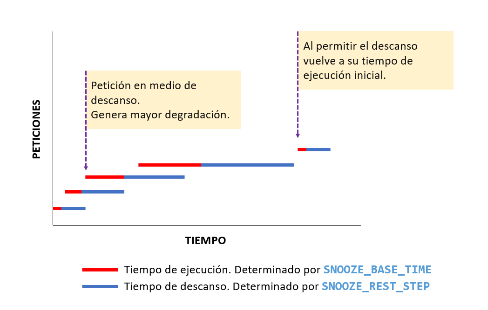

# Modo degradación

Para poder diseñar y probar que nuestras aplicaciones son resilientes, es necesario que simulemos que estamos comunicándonos con aplicaciones que se empiezan a degradar con el tiempo.

Las cuatro aplicaciones tienen una versión que permite simular un comportamiento de degradación.

## Despliegue

Para desplegar las aplicaciones en modo degradación debe hacer uso de una versión distinta de cada contenedora. A continuación, la lista de cada una.

|Aplicación|URI|
|---|---|
|Agenda|<code>ghcr.io/misw-4301-desarrollo-apps-en-la-nube/agenda-service-p2:buggy</code>
|Pedidos|<code>ghcr.io/misw-4301-desarrollo-apps-en-la-nube/orders-service-p2:buggy</code>
|Pagos|<code>ghcr.io/misw-4301-desarrollo-apps-en-la-nube/payments-service-p2:buggy</code>
|Proveedores|<code>ghcr.io/misw-4301-desarrollo-apps-en-la-nube/sellers-service-p2:buggy</code>|

Modifique los archivos **compose.yml** y **k8-deployments.yml** referenciando a estas versiones de las contenedoras para que pueda hacer pruebas con un sistema en degradación.

## Funcionamiento

El funcionamiento de la degradación se simula con las siguientes variables.

- **REQUEST_TIME**: Representa el tiempo en milisegundos que se demora una solicitud.
- **SNOOZE_BASE_TIME**: Tiempo base configurado de demora de una petición, el cual será el punto de referencia cuando la contenedora esté bien. Este se asigna al valor **REQUEST_TIME** y por defecto es 100 milisegundos.
- **SNOOZE_REST_STEP**: Multiplicador del tiempo **REQUEST_TIME** que la contenedora necesita descansar después de cada solicitud. Por defecto es 2.
> Ejemplo:
> - Si **REQUEST_TIME** = 100ms, y **SNOOZE_REST_STEP** es 2, el tiempo de descanso de la contenedora para recibir otra petición debería ser 200ms.
> - Si **REQUEST_TIME** = 1000ms, y **SNOOZE_REST_STEP** es 5, el tiempo de descanso de la contenedora para recibir otra petición debería ser 5s.

Por lo tanto:

1. Cada vez que se haga una petición a la contenedora, esta petición tendrá un tiempo mínimo de ejecución configurado por medio de **SNOOZE_BASE_TIME**.
2. La contenedora deberá descansar después de cada solicitud un total de tiempo representado por **REQUEST_TIME** * **SNOOZE_REST_STEP**.
3. Si la contenedora recibe una petición durante su tiempo de descanso, el valor de **REQUEST_TIME** se incrementará en el valor de **SNOOZE_BASE_TIME**.
4. La degradación se incrementará cada vez más a medida que se reciban peticiones que no permitan el descanso de la aplicación.

Este comportamiento se puede explicar por medio de esta imagen:

.

## Configuración

Ambas variables de configuración tienen un valor por defecto, **SNOOZE_BASE_TIME** tiene el valor de 100ms y **SNOOZE_REST_STEP** es 2.

Para modificarlas puede hacerlo de la siguiente manera:

- compose.yml
````
    ...
    <service>:
        image: <image-path>
        ...
        environment:
            SNOOZE_BASE_TIME: 200
            SNOOZE_REST_STEP: 5
````
- k8-deployments.yml
````
    ...
    spec:
      containers:
        - name: <name>
          image: <image-path>
          ...
          env:
            - name: SNOOZE_BASE_TIME
              value: 200
            - name: SNOOZE_REST_STEP
              value: 5
````

En este ejemplo, el tiempo mínimo de cada petición será de 200 milisegundos y requiere un tiempo de descanso de 1 segundo.

> **Nota:** las peticiones a las rutas <code>app/health/ping</code> no presentan degradación, para evitar errores con los balanceadores de carga durante las pruebas.